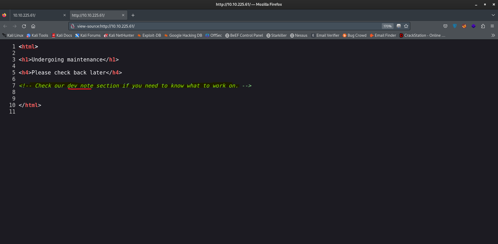

# Basic-Pentesting Walkthrough
Easy Tryhackme Free Machine

## Recon 
### First: Run a nmap scan to get the open-ports and services with ```nmap -A -sV -p- -T4 -Pn  10.10.225.61```


### So we need to take a look at each service, let's start with HTTP!
### When we visited the website of the machine we found a note : Check our dev note section if you need to know what to work on.




### Then we did a direcotory fuzzing and this is the result. 


### which redirected us to development page and found this notes.


#### So this means the user have J as nickname have a weak password

### Now, It's your turn samba!


#### We note that there's a file called staff.txt
#### So the user that have a weak password called jan

#### So let's crack jan's password with hydra


# Let's login with jan creds


#### After some minutes we found that the ssh private key of kay user is available!, so you got it and try to crack it 
### Challenge: take this id_rsa and try to get the paraphrase of it (Hint: Use JohnTheRipper)


# And that's it, you can now open the password file!

